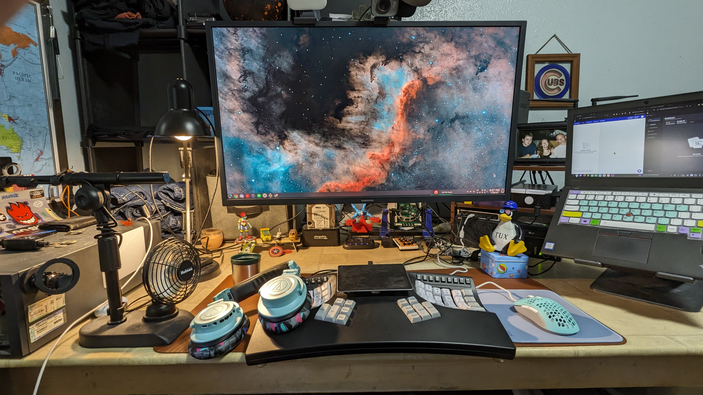

> Dracula (color scheme). All of the things.

# CSmertX.com (hobbies)
All my computer and Linux notes can be found at: 🔗[CSx](https://csmertx.com). Which is hosted here: 🔗https://github.com/csmertx/csmertx.github.io

# Here Be Dragons

- For scripts: variables may need adjustment.

- The Imgur album below is from 2017-2018 with a Windows XP era computer--2006 model purchased in 2014 for $300 with 4GB of RAM--same PC I used to fund most of the stuff in the 🔗[January 2023 photo](desktop_jan_2023.jpg)

    - 🔗[Imgur album | 20+ screenshots](https://imgur.com/a/VXpYHBM)

## KDE Plasma Logo

- Logo of the 🔗[KDE Community](https://kde.org/ "KDE Community")

- Referenced here: 🔗[KDE / Press Kit / KDE Clipart](https://kde.org/stuff/clipart/ "KDE / Press Kit / KDE Clipart").

## Cool stuff

- 🔗[Bash Beginners Guide](https://tldp.org/LDP/Bash-Beginners-Guide/html/)

- 🔗[Linux Command Line and Shell Scripting Bible, 3rd Edition](https://www.oreilly.com/library/view/linux-command-line/9781118983843/)

- 🔗[Fedora Magazine | Bash Shell Scripting for beginners (Part 1)](https://fedoramagazine.org/bash-shell-scripting-for-beginners-part-1/)

- 🔗[LearnLinuxTV | Introduction into Bash Scripting](https://www.youtube.com/watch?v=NWWvZa-qlRE&list=PLT98CRl2KxKG2RCPkG6EPOA-g1FmLfcZl)

- 🔗[LearnLinuxTV | Arch Linux: Full Installation Guide - A complete tutorial/walkthrough in one video!](https://www.youtube.com/watch?v=DPLnBPM4DhI)

- 🔗[Arch Linux Wiki](https://wiki.archlinux.org/)

- 🔗[The Konsole Handbook](https://docs.kde.org/trunk5/en/konsole/konsole/konsole.pdf)

- 🔗[ubuntu forums](https://ubuntuforums.org/)

- 🔗[Debian Wiki](https://wiki.debian.org/)

- 🔗[nixCraft](https://www.cyberciti.biz/)

- 🔗[aristocratos/bpytop: Linux/OSX/FreeBSD resource monitor](https://github.com/aristocratos/bpytop)

- 🔗[Vintage Linux](https://archive.org/search.php?query=linux&and%5B%5D=collection%3A%22vintagesoftware%22&page=1)

## Bonus Music Video

- 🔗[Makeup and Vanity Set - Algorithm (Endless Destiny) (DATA093)](https://www.youtube.com/watch?v=Hx3748DvS7k "YouTube | Makeup and Vanity Set - Algorithm (Endless Destiny) (DATA093)")
