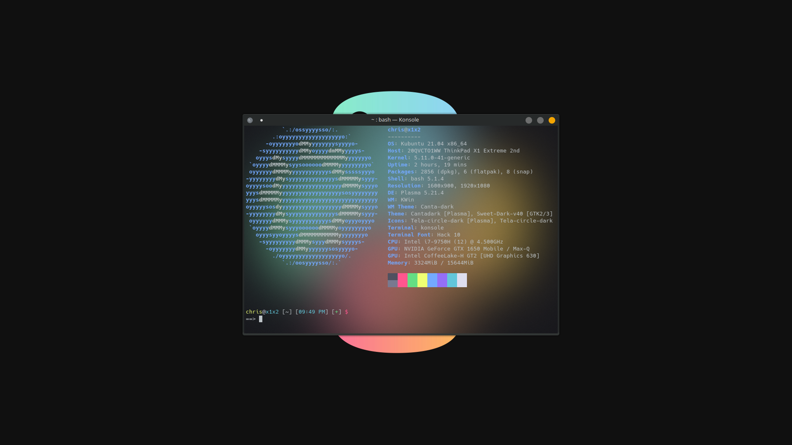

# Here Be Dragons?

- All stuff here.. works on my systems.. ┻━┻ ︵ ¯\ (ツ)/¯ ︵ ┻━┻

- [Imgur album | 20+ screenshots](https://imgur.com/a/VXpYHBM)

## Resources
- [Bash Beginners Guide](https://tldp.org/LDP/Bash-Beginners-Guide/html/)
- [LearnLinuxTV | Introduction into Bash Scripting](https://www.youtube.com/watch?v=NWWvZa-qlRE&list=PLT98CRl2KxKG2RCPkG6EPOA-g1FmLfcZl)
- [LearnLinuxTV | Arch Linux: Full Installation Guide - A complete tutorial/walkthrough in one video!](https://www.youtube.com/watch?v=DPLnBPM4DhI)
- [Linux Command Line and Shell Scripting Bible, 3rd Edition](https://www.oreilly.com/library/view/linux-command-line/9781118983843/)
- [Arch Linux Wiki](https://wiki.archlinux.org/)
- [ubuntu forums](https://ubuntuforums.org/)
- [Debian Wiki](https://wiki.debian.org/)
- [nixCraft](https://www.cyberciti.biz/)
- [Archive.org | Vintage Linux](https://archive.org/search.php?query=linux&and%5B%5D=collection%3A%22vintagesoftware%22&page=1)
