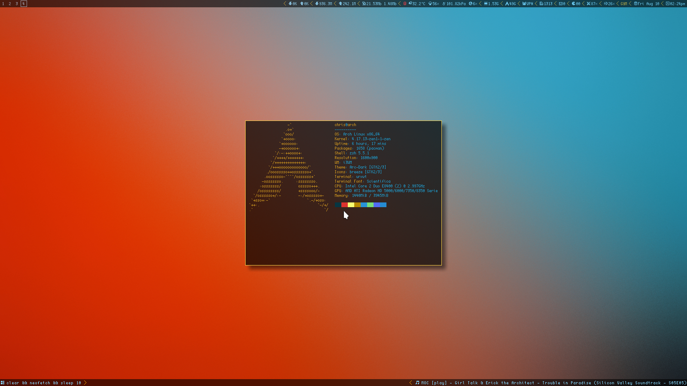

# Here Be Dragons

- Probably not POSIX compliant.

_ I make no claims regarding my competency.

- Definitely not ideal for a multi user system.

- For CPU heavy tasks I use Enlightenment or Openbox.

