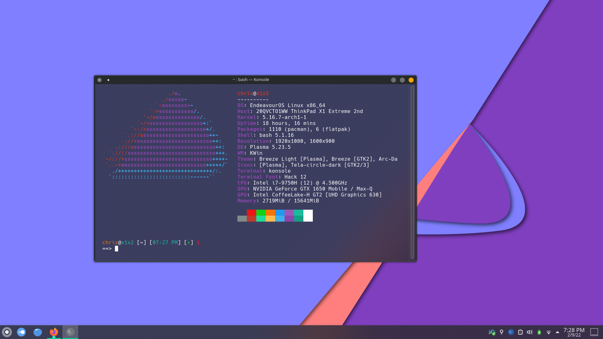

# Here Be Dragons? (previously: @csmertx)

- Scripts require careful eye for variables, etc.  The older stuff was due to 4GB of RAM, and grade school DOS nostalgia.

- [Imgur album | 20+ screenshots](https://imgur.com/a/VXpYHBM)

## Resources
- [Bash Beginners Guide](https://tldp.org/LDP/Bash-Beginners-Guide/html/)
- [Linux Command Line and Shell Scripting Bible, 3rd Edition](https://www.oreilly.com/library/view/linux-command-line/9781118983843/)
- [Fedora Magazine | Bash Shell Scripting for beginners (Part 1)](https://fedoramagazine.org/bash-shell-scripting-for-beginners-part-1/)
- [LearnLinuxTV | Introduction into Bash Scripting](https://www.youtube.com/watch?v=NWWvZa-qlRE&list=PLT98CRl2KxKG2RCPkG6EPOA-g1FmLfcZl)
- Outdated as of: 2022 [LearnLinuxTV | Arch Linux: Full Installation Guide - A complete tutorial/walkthrough in one video!](https://www.youtube.com/watch?v=DPLnBPM4DhI)
- [Arch Linux Wiki](https://wiki.archlinux.org/)
- [The Konsole Handbook](https://docs.kde.org/trunk5/en/konsole/konsole/konsole.pdf)
- [ubuntu forums](https://ubuntuforums.org/)
- [Debian Wiki](https://wiki.debian.org/)
- [nixCraft](https://www.cyberciti.biz/)
- [aristocratos/bpytop: Linux/OSX/FreeBSD resource monitor
](https://github.com/aristocratos/bpytop)
- [Vintage Linux](https://archive.org/search.php?query=linux&and%5B%5D=collection%3A%22vintagesoftware%22&page=1)
