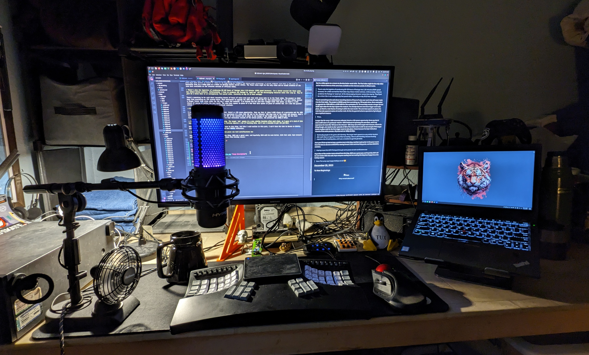

> It's like a rough life draft or something

# Trouble with yt-dlp and Ubuntu 23.04 (fragment download error)

Not sure if I was seeing an isolated issue, but here is the steps I took to download stuff again

- ```sudo apt-get remove yt-dlp```

- Clear other instances of yt-dlp from the system (/usr/local/bin/yt-dlp, etc.)

- Linux/BSD button via 🔗[Github: yt-dlp/yt-dlp](https://github.com/yt-dlp/yt-dlp)

- Toss the binary in $HOME/.local/bin

- ```sudo chmod -X $HOME/.local/bin/yt-dlp```

# LGM
All my computer and Linux notes can be found at: 🔗[Linux Gremlin Mysteries](https://csmertx.github.io/). Which is hosted via: 🔗https://github.com/csmertx/csmertx.github.io

# Here Be Dragons

- For scripts: variables may need adjustment.

- The Imgur album below is from 2017-2018 via a Windows XP era computer--2006 model purchased in 2014 for $300 with 4GB of RAM--same PC I used to fund most of the stuff thing in the [January 2023 photo](desktop_jan_2023.jpg)

    - 🔗[Imgur album | 20+ screenshots](https://imgur.com/a/VXpYHBM)

## KDE Plasma Logo

- Logo of the 🔗[KDE Community](https://kde.org/ "KDE Community")

- Referenced via 🔗[KDE / Press Kit / KDE Clipart](https://kde.org/stuff/clipart/ "KDE / Press Kit / KDE Clipart").

## Resources
- 🔗[Bash Beginners Guide](https://tldp.org/LDP/Bash-Beginners-Guide/html/)
- 🔗[Linux Command Line and Shell Scripting Bible, 3rd Edition](https://www.oreilly.com/library/view/linux-command-line/9781118983843/)
- 🔗[Fedora Magazine | Bash Shell Scripting for beginners (Part 1)](https://fedoramagazine.org/bash-shell-scripting-for-beginners-part-1/)
- 🔗[LearnLinuxTV | Introduction into Bash Scripting](https://www.youtube.com/watch?v=NWWvZa-qlRE&list=PLT98CRl2KxKG2RCPkG6EPOA-g1FmLfcZl)
- 🔗[LearnLinuxTV | Arch Linux: Full Installation Guide - A complete tutorial/walkthrough in one video!](https://www.youtube.com/watch?v=DPLnBPM4DhI)
- 🔗[Arch Linux Wiki](https://wiki.archlinux.org/)
- 🔗[The Konsole Handbook](https://docs.kde.org/trunk5/en/konsole/konsole/konsole.pdf)
- 🔗[ubuntu forums](https://ubuntuforums.org/)
- 🔗[Debian Wiki](https://wiki.debian.org/)
- 🔗[nixCraft](https://www.cyberciti.biz/)
- 🔗[aristocratos/bpytop: Linux/OSX/FreeBSD resource monitor](https://github.com/aristocratos/bpytop)
- 🔗[Vintage Linux](https://archive.org/search.php?query=linux&and%5B%5D=collection%3A%22vintagesoftware%22&page=1)
